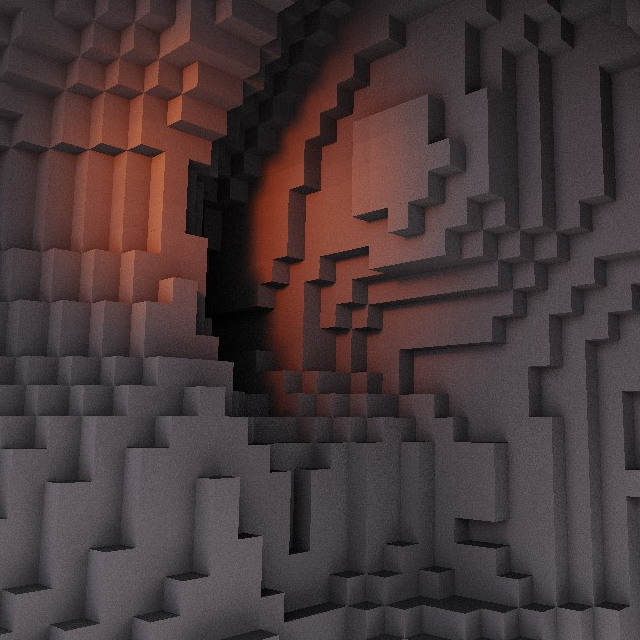
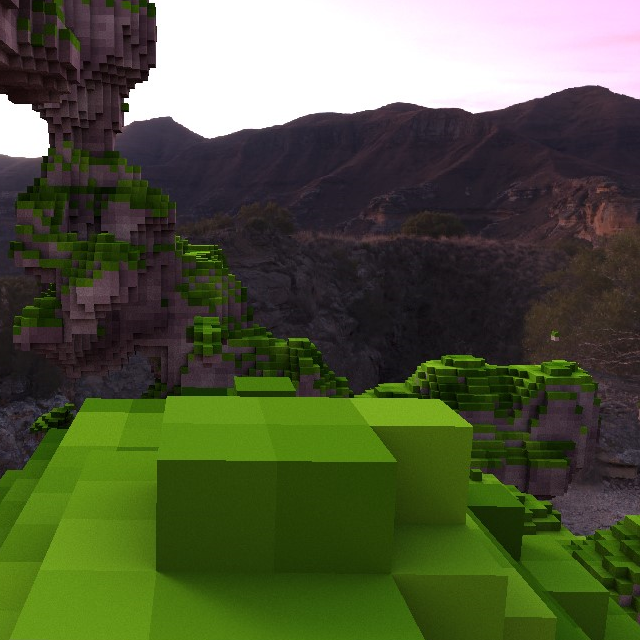
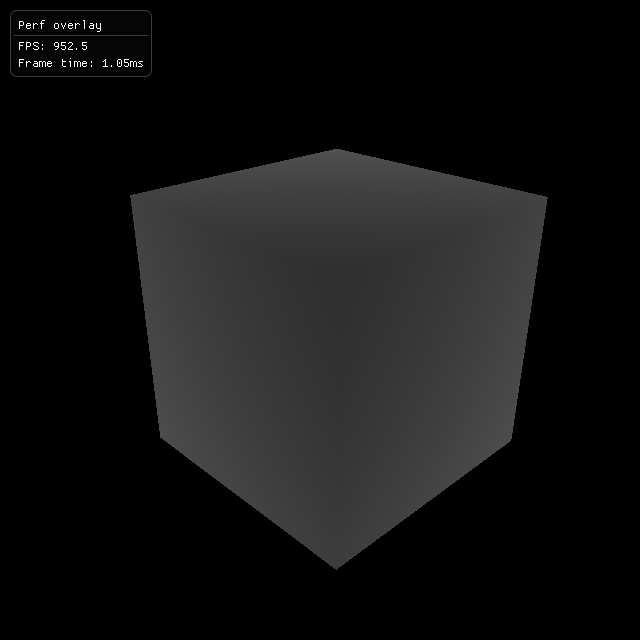
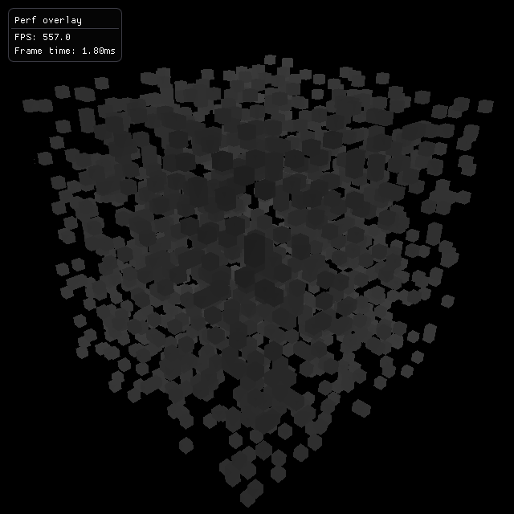

<div class="page-head">
    <i>18/04/2024 ~ #ray-tracing ~ #voxels ~ #grid-traversal</i>
    <h1> Amanatides and Woo</h1>
    <p>One <span class="yellow">step</span> at a time</p>
</div>

## Introduction

In this article we will dive deep into [Amanatides and Woo's fast voxel traversal algorithm](https://www.researchgate.net/publication/2611491_A_Fast_Voxel_Traversal_Algorithm_for_Ray_Tracing).<br>
Designed for, however not limited to, <span class="yellow">ray tracing</span> voxel grids.<br>

> Most visual examples in this article will be 2D for convenience however, the concepts are the same for 3D.<br>
> All code snippets provided will be using C++ 20 and will be for 3D voxel traversal.

You may wonder *"What can voxel ray tracing do?"*.<br>
Here's two screenshots taken from my own `CPU` voxel ray tracer: 

<div class="h-group">
<figure title="Ray traced voxels with lighting">

</figure>
<figure title="Ray traced voxel terrain">

</figure>
</div>

Together we're going to find out how and why this algorithm works.<br>
*So, let's dive in!*

## Prerequisites

To get started tracing anything, we need some <span class="yellow">data to traverse</span>!<br>
Let's setup a little `VoxelTracer` class together:

```cpp
constexpr int GRID_SIDE = 32;
constexpr int GRID_SIZE = GRID_SIDE * GRID_SIDE * GRID_SIDE;

class VoxelTracer {
    /* Grid voxel data. */
    unsigned int grid[GRID_SIZE];

    /* Grid minimum and maximum point in world space. (x, y, z) */
    vec3 grid_min, grid_max;

  public:
    VoxelTracer() { 
        grid_min = vec3(0, 0, 0);
        grid_max = vec3(1, 1, 1);

        /* TODO: fill `grid` with data */
    }

    /**
     * @brief Find the nearest intersection with the grid.
     * @return `1e30f` if no intersection was found.
     */
    float find_nearest(const vec3& ro, const vec3& rd) const;
};
```

What to fill `grid` with is up to you.<br>
Each voxel in the grid is stored as a color `unsigned int`, RGBA.

> For some inspiration: you could fill it with a noise pattern, like Perlin noise.

Futhermore, before we start the traversal we need to <span class="yellow">intersect</span> our ray with the <span class="yellow">grid bounding box</span>.<br>
If our ray **doesn't** intersect the grid then we don't need to traverse it.<br>
If our ray **does** intersect we will also get the time along the ray where it enters the grid called `entry_t`.

```cpp
/**
 * @brief Ray vs AABB intersection test. (can be optimized further)
 * @return Ray entry time, `1e30f` if no intersection was found.
 */
float ray_aabb(const vec3& min, const vec3& max, const vec3& ro, const vec3& rd) {
    float tmin = 0, tmax = 1e30f;

    /* Loop will be unrolled */
    for (int axis = 0; axis < 3; ++axis) {
        const float t1 = (min[axis] - ro[axis]) / rd[axis];
        const float t2 = (max[axis] - ro[axis]) / rd[axis];

        const float dmin = min(t1, t2);
        const float dmax = max(t1, t2);

        tmin = max(dmin, tmin);
        tmax = min(dmax, tmax);
    }

    if (tmax >= tmin) return tmin;
    return 1e30f; /* miss */
}
```
<sup>Snippet A.</sup>

*Snippet A* shows a basic <span class="yellow">ray vs aabb</span> intersection test you can use.<br>
It is not an optimal one, nevertheless it will get the job done for now.

We can now put this intersection test at the top of our `find_nearest` function.<br>
And for now, we can just return `entry_t` if there was a hit.

```cpp
float VoxelTracer::find_nearest(const vec3& ro, const vec3& rd) const {
    /* Find the ray entry point */ 
    const float entry_t = ray_aabb(grid_min, grid_max, ro, rd);

    if (entry_t == 1e30f) return 1e30f; /* miss */

    /* TODO: voxel traversal */

    return entry_t; /* hit */
}
```

If we shoot a ray for each pixel on screen, and turn the output of `find_nearest` into a grayscale color.<br>
We should get something that looks like this:

<figure title="Testing our ray vs aabb intersection">

</figure>

## Traversal Concept

The concept of <span class="yellow">Amanatides and Woo's</span> algorithm is simple:<br>
We find at what time along the ray each axis crosses its next cell boundary.<br>
The maximum time until we cross the next axis cell boundary is often called `tmax`.

At any point in the grid our next step will be on the axis where `tmax` is the smallest.<br>
That might sound confusing, to hopefully make it more clear, I made this graphic:

<figure title="Figure A: Amanatides and Woo in action">
    <svg class="fig" width="256" viewBox="0 0 194.5 194.5">
        <pattern id="grid32" width="32" height="32" patternUnits="userSpaceOnUse">
            <line x1="0" y1="0" x2="0" y2="32" stroke="#342c28" stroke-width="4" />
            <line x1="0" y1="0" x2="32" y2="0" stroke="#342c28" stroke-width="4" />
        </pattern>
        <pattern id="grid64" width="64" height="64" patternUnits="userSpaceOnUse">
            <rect width="64" height="64" fill="url(#grid32)" />
            <line x1="0" y1="0" x2="0" y2="64" stroke="#3d3a34" stroke-width="5" />
            <line x1="0" y1="0" x2="64" y2="0" stroke="#3d3a34" stroke-width="5" />
        </pattern>
        <rect x="0" y="0" width="194.5" height="194.5" rx="3px" ry="3px" fill="url(#grid64)" />
        <g>
            <g fill="none" stroke-dashoffset="21.9" stroke-linecap="round" stroke-linejoin="round" stroke-width="3">
            <g stroke="#7b3333">
            <rect x="65.25" y="65.25" width="32" height="32" opacity="1">
                <animate
                    attributeName="opacity"
                    values="1;1;1;1;1; 0;0;0;0;0; 0;0;0;0;3"
                    dur="15s"
                    repeatCount="indefinite" />
            </rect>
            <rect x="97.25" y="65.25" width="32" height="32" opacity="0">
                <animate
                    attributeName="opacity"
                    values="0;0;0;0;0; 1;1;1;1;1; 0;0;0;0;0"
                    dur="15s"
                    repeatCount="indefinite" />
            </rect>
            <rect x="97.25" y="97.25" width="32" height="32" opacity="0">
                <animate
                    attributeName="opacity"
                    values="0;0;0;0;0; 0;0;0;0;0; 1;1;1;1;0"
                    dur="15s"
                    repeatCount="indefinite" />
            </rect>
            </g>
            </g>
            <g stroke-linecap="round" stroke-linejoin="round">
            <text x="3.1620638" y="23.12842" fill="#3d3a34" font-size="20.05px" letter-spacing="-4px" stroke-dasharray="13.3663, 13.3663" stroke-width="3.3416" xml:space="preserve"><tspan x="3.1620638" y="23.12842" fill="#3d3a34" font-family="'JetBrains Mono'" font-weight="800" letter-spacing="-4px" stroke-width="3.3416">0,0</tspan></text>
            <path d="m189.52 109.14-2.0996 8.5706 7.0768-2.8089z" fill="#7e4d05" stroke="#7e4d05" stroke-dashoffset="21.9" stroke-width="3"/>
            <rect x="59.773" y="11.5" width="10.971" height="10.971" fill="none" stroke="#7b3333" stroke-dashoffset="21.9" stroke-width="3"/>
            <text x="80.952148" y="20.707891" fill="#7b3333" font-size="10.716px" stroke-dasharray="13.3663, 13.3663" stroke-width="3.3416" xml:space="preserve"><tspan x="80.952148" y="20.707891" fill="#7b3333" font-family="'JetBrains Mono'" font-size="10.716px" font-weight="800" stroke-width="3.3416">current position</tspan></text>
            </g>
            <g fill="#fff">
            <path d="m64 81.304 130.5 33.599" stroke="#7e4d05" stroke-linecap="round" stroke-linejoin="round" stroke-width="3"/>
            <path d="m0 64 64 17.304" stroke="#fed436" stroke-linecap="round" stroke-linejoin="round" stroke-width="3"/>
            <circle cx="65.5" cy="81.25" r="6"/>
            <circle cx="97.25" cy="89.562" r="6">
                <animate
                    attributeName="cx"
                    values="97.25;97.25;97.25;97.25;97.25; 97.25;97.25;129.25;129.25;129.25; 129.25;129.25;129.25;129.25;97.25"
                    dur="15s"
                    repeatCount="indefinite" />
                <animate
                    attributeName="cy"
                    values="89.56;89.56;89.56;89.56;89.56; 89.56;89.56;98.1;98.1;98.1; 98.1;98.1;98.1;98.1;89.56"
                    dur="15s"
                    repeatCount="indefinite" />
            </circle>
            <circle cx="126.17" cy="97.25" r="6"/>
            </g>
            <g font-size="20.05px" stroke-dasharray="13.3663, 13.3663" stroke-linecap="round" stroke-linejoin="round" stroke-width="3.3416">
            <text x="91.370811" y="110.78358" fill="#ffffff" xml:space="preserve" opacity="1"><tspan x="91.370811" y="110.78358" fill="#ffffff" font-family="'JetBrains Mono'" font-weight="800" stroke-width="3.3416">x</tspan>
                <animate
                    attributeName="opacity"
                    values="1;1;1;1;1; 1;0;0;0;0; 0;0;0;0;1"
                    dur="15s"
                    repeatCount="indefinite" />
            </text>
            <text x="123.34025" y="87.041496" fill="#ffffff" xml:space="preserve" opacity="0"><tspan x="123.34025" y="87.041496" fill="#ffffff" font-family="'JetBrains Mono'" font-weight="800" stroke-width="3.3416">x</tspan>
                <animate
                    attributeName="opacity"
                    values="0;0;0;0;0; 0;0;0;1;1; 1;1;1;1;0"
                    dur="15s"
                    repeatCount="indefinite" />
            </text>
            <text x="27.307766" y="166.32771" fill="#fed436" letter-spacing="4px" xml:space="preserve" opacity="1">
                <tspan x="27.307766" y="166.32771" fill="#fed436" font-family="'JetBrains Mono'" font-weight="800" letter-spacing="4px" stroke-width="3.3416">x&lt;y</tspan>
                <animate
                    attributeName="opacity"
                    values="1;1;1;1;1; 1;0;0;0;0; 0;0;0;0;1"
                    dur="15s"
                    repeatCount="indefinite" />
            </text>
            <text x="123.363" y="166.02879" fill="#fed436" letter-spacing="4px" xml:space="preserve" opacity="0">
                <tspan x="123.363" y="166.02879" fill="#fed436" font-family="'JetBrains Mono'" font-weight="800" letter-spacing="4px" stroke-width="3.3416">y&lt;x</tspan>
                <animate
                    attributeName="opacity"
                    values="0;0;0;0;0; 0;0;0;1;1; 1;1;1;1;0"
                    dur="15s"
                    repeatCount="indefinite" />
            </text>
            <text x="120.29847" y="117.86388" fill="#ffffff" xml:space="preserve"><tspan x="120.29847" y="117.86388" fill="#ffffff" font-family="'JetBrains Mono'" font-weight="800" stroke-width="3.3416">y</tspan></text>
            </g>
        </g>
    </svg>
</figure>

We can see that on the <span class="yellow">1st</span> step, `tmax.x` is the smallest, because the `x` axis will cross its cell boundary before the `y` axis.<br>
Then on the <span class="yellow">2nd</span> step, `tmax.x` was updated and it is now larger than `tmax.y`, therefore the next step is on the `y` axis.<br>

Now the question is *"How do we calculate `tmax`?"*.<br>
That's what we're going to find out next.

## Traversal Setup

Now that we have our `VoxelTracer`, and we understand the basic concept, we can start implementing the algorithm.<br>
Let's start with 2 important variables which will <span class="yellow">remain constant</span> during traversal:

<div class="h-group">
<figure title="Figure B: Step (direction signs)">
    <svg class="fig" width="256" viewBox="0 0 194.5 194.5">
        <pattern id="grid32" width="32" height="32" patternUnits="userSpaceOnUse">
            <line x1="0" y1="0" x2="0" y2="32" stroke="#342c28" stroke-width="4" />
            <line x1="0" y1="0" x2="32" y2="0" stroke="#342c28" stroke-width="4" />
        </pattern>
        <pattern id="grid64" width="64" height="64" patternUnits="userSpaceOnUse">
            <rect width="64" height="64" fill="url(#grid32)" />
            <line x1="0" y1="0" x2="0" y2="64" stroke="#3d3a34" stroke-width="5" />
            <line x1="0" y1="0" x2="64" y2="0" stroke="#3d3a34" stroke-width="5" />
        </pattern>
        <rect x="0" y="0" width="194.5" height="194.5" rx="3px" ry="3px" fill="url(#grid64)" />
        <g>
            <text x="3.1620638" y="23.12842" fill="#3d3a34" font-size="20.05px" letter-spacing="-4px" stroke-dasharray="13.3663, 13.3663" stroke-linecap="round" stroke-linejoin="round" stroke-width="3.3416" xml:space="preserve"><tspan x="3.1620638" y="23.12842" fill="#3d3a34" font-family="'JetBrains Mono'" font-weight="800" letter-spacing="-4px" stroke-width="3.3416">0,0</tspan></text>
            <g fill="#ffffff" font-size="20.05px" stroke-dasharray="13.3663, 13.3663" stroke-linecap="round" stroke-linejoin="round" stroke-width="3.3416">
            <text x="108.10543" y="135.54257" letter-spacing="0px" xml:space="preserve"><tspan x="108.10543" y="135.54257" fill="#ffffff" font-family="'JetBrains Mono'" font-weight="800" letter-spacing="0px" stroke-width="3.3416">1</tspan></text>
            <text x="66.967758" y="104.56811" letter-spacing="0px" xml:space="preserve"><tspan x="66.967758" y="104.56811" fill="#ffffff" font-family="'JetBrains Mono'" font-weight="800" letter-spacing="0px" stroke-width="3.3416">-1</tspan></text>
            <text x="109.36742" y="84.158424" xml:space="preserve"><tspan x="109.36742" y="84.158424" fill="#ffffff" font-family="'JetBrains Mono'" font-weight="800" stroke-width="3.3416">step</tspan></text>
            </g>
            <g stroke-dashoffset="21.9" stroke-linecap="round" stroke-linejoin="round" stroke-width="3">
            <path d="m97.25 114.03v-32.034" fill="#fff" fill-opacity=".4" stroke="#fff"/>
            <path d="m129.28 109.62v8.824l6.2052-4.412z" fill="#fff" stroke="#fff"/>
            <path d="m187.15 77.817 3.0598 8.2766 4.2904-6.29z" fill="#fed436" stroke="#fed436"/>
            </g>
            <g fill="#fff">
            <g stroke-dashoffset="21.9" stroke-linecap="round" stroke-linejoin="round" stroke-width="3">
            <path d="m92.838 81.998h8.8241l-4.412-6.2052z" stroke="#fff"/>
            <path d="m0 148.26 194.5-68.456" fill-opacity=".4" stroke="#fed436"/>
            <path d="m97.25 114.03h32.034" fill-opacity=".4" stroke="#fff"/>
            </g>
            <circle cx="97.25" cy="114.03" r="6"/>
            </g>
        </g>
    </svg>
</figure>
<figure title="Figure C: Delta (reciprocal direction)">
    <svg class="fig" width="256" viewBox="0 0 194.5 194.5">
        <pattern id="grid32" width="32" height="32" patternUnits="userSpaceOnUse">
            <line x1="0" y1="0" x2="0" y2="32" stroke="#342c28" stroke-width="4" />
            <line x1="0" y1="0" x2="32" y2="0" stroke="#342c28" stroke-width="4" />
        </pattern>
        <pattern id="grid64" width="64" height="64" patternUnits="userSpaceOnUse">
            <rect width="64" height="64" fill="url(#grid32)" />
            <line x1="0" y1="0" x2="0" y2="64" stroke="#3d3a34" stroke-width="5" />
            <line x1="0" y1="0" x2="64" y2="0" stroke="#3d3a34" stroke-width="5" />
        </pattern>
        <rect x="0" y="0" width="194.5" height="194.5" rx="3px" ry="3px" fill="url(#grid64)" />
        <g>
            <g stroke-linecap="round" stroke-linejoin="round">
            <g>
            <g font-size="20.05px" stroke-dasharray="13.3663, 13.3663" stroke-width="3.3416">
                <text x="3.1620638" y="23.12842" fill="#3d3a34" letter-spacing="-4px" xml:space="preserve"><tspan x="3.1620638" y="23.12842" fill="#3d3a34" font-family="'JetBrains Mono'" font-weight="800" letter-spacing="-4px" stroke-width="3.3416">0,0</tspan></text>
                <text transform="rotate(-19.392)" x="24.338623" y="116.30575" fill="#ffffff" xml:space="preserve"><tspan x="24.338623" y="116.30575" fill="#ffffff" font-family="'JetBrains Mono'" font-weight="800" stroke-width="3.3416">delta<tspan baseline-shift="sub" font-size="65%">y</tspan></tspan></text>
                <text transform="rotate(-19.392)" x="4.6828022" y="174.56879" fill="#ffffff" xml:space="preserve"><tspan x="4.6828022" y="174.56879" fill="#ffffff" font-family="'JetBrains Mono'" font-weight="800" stroke-width="3.3416">delta<tspan baseline-shift="sub" font-size="65%">x</tspan></tspan></text>
            </g>
            <path d="m187.15 77.817 3.0598 8.2766 4.2904-6.29z" fill="#7e4d05" stroke="#7e4d05" stroke-dashoffset="21.9" stroke-width="3"/>
            </g>
            <g fill="none" stroke-dashoffset="21.9" stroke-width="3">
            <path d="m144.69 97.014-4.0816-11.643-90.342 31.87 4.0816 11.643" stroke="#fff"/>
            <path d="m65.25 125.62 4.0816 11.643 31.974-11.286-4.1065-11.634" stroke="#fff"/>
            <path d="m0 148.26 194.5-68.456" stroke="#7e4d05"/>
            </g>
            <g fill="#7b3333" stroke="#fed436" stroke-dashoffset="21.9" stroke-width="3">
            <path d="m17.25 97.25v32"/>
            <path d="m11.879 97.25h10.742"/>
            <path d="m65.25 171.88v10.742"/>
            <path d="m97.25 171.88v10.742"/>
            <path d="m11.879 129.25h10.742"/>
            <path d="m65.25 177.25h32"/>
            </g>
            </g>
        </g>
    </svg>
</figure>
</div>

The <span class="yellow">first variable</span> `step` will be used to move through the grid along the ray direction.<br>
Computed for each axis, if the ray direction axis is **positive** it is `1`  and `-1` if **negative**.<br>
Here's what that would look like in C++:

```cpp
/** @brief Get the sign of a float (-1 or 1) */
inline int getsign(const float f) { return 1 - (int)(((unsigned int&)f) >> 31) * 2; }

/** @brief Get the signs of a 3D vector (-1 or 1) */
inline vec3 sign_of_dir(const vec3& v) {
    return vec3(getsign(v.x), getsign(v.y), getsign(v.z));
}
```

The <span class="yellow">second variable</span> we need is `delta`, it is used to update `tmax` during traversal.<br>
Computed for each axis, it is the **absolute** of `1.0` divided by the ray direction axis, also referred to as the reciprocal.

Now there's just 2 more variables left, these variables will be updated <span class="yellow">every step</span> during traversal.

<div class="h-group">
<figure title="Figure D: Finding entry cell by truncating">
    <svg class="fig" width="256" viewBox="0 0 194.5 194.5">
        <pattern id="grid32" width="32" height="32" patternUnits="userSpaceOnUse">
            <line x1="0" y1="0" x2="0" y2="32" stroke="#342c28" stroke-width="4" />
            <line x1="0" y1="0" x2="32" y2="0" stroke="#342c28" stroke-width="4" />
        </pattern>
        <pattern id="grid64" width="64" height="64" patternUnits="userSpaceOnUse">
            <rect width="64" height="64" fill="url(#grid32)" />
            <line x1="0" y1="0" x2="0" y2="64" stroke="#3d3a34" stroke-width="5" />
            <line x1="0" y1="0" x2="64" y2="0" stroke="#3d3a34" stroke-width="5" />
        </pattern>
        <rect x="0" y="0" width="194.5" height="194.5" rx="3px" ry="3px" fill="url(#grid64)" />
        <g>
            <path d="m64 81.304 130.5 33.599" fill="#fff" stroke="#7e4d05" stroke-linecap="round" stroke-linejoin="round" stroke-width="3"/>
            <path d="m65.249 194.5 7e-4 -129.25 129.25 0.16817" fill="none" stroke="#fff" stroke-opacity=".53333" stroke-dasharray="12, 12" stroke-dashoffset="21.9" stroke-linecap="round" stroke-linejoin="round" stroke-width="3"/>
            <g stroke-linecap="round" stroke-linejoin="round">
            <text x="93.092438" y="134.0918" fill="#ffffff" fill-opacity=".53333" font-size="20.05px" stroke-dasharray="13.3663, 13.3663" stroke-width="3.3416" xml:space="preserve"><tspan x="93.092438" y="134.0918" fill="#ffffff" fill-opacity=".53333" font-family="'JetBrains Mono'" font-weight="800" stroke-width="3.3416">object</tspan></text>
            <text x="4.1620638" y="24.12842" fill="#3d3a34" font-size="20.05px" stroke-dasharray="13.3663, 13.3663" stroke-width="3.3416" letter-spacing="-4px" xml:space="preserve"><tspan x="3.1620638" y="24.12842" fill="#3d3a34" font-family="'JetBrains Mono'" font-weight="800" letter-spacing="-4px" stroke-width="3.3416">0,0</tspan></text>
            <text x="49.56469" y="46.115707" fill="#fed436" fill-opacity="0" font-size="20.05px" stroke-dasharray="13.3663, 13.3663" stroke-width="3.3416" xml:space="preserve"><tspan x="49.56469" y="46.115707" fill="#fed436" font-family="'JetBrains Mono'" font-weight="800" stroke-width="3.3416">entry cell</tspan>
                <animate
                    attributeName="fill-opacity"
                    values="0;0;0;0;1;1;1;0;0;0;0"
                    dur="10s"
                    repeatCount="indefinite" />
            </text>
            <path d="m0 64 64 17.304" fill="#fff" stroke="#fed436" stroke-width="3"/>
            </g>
            <rect x="65.25" y="65.25" width="32" height="32" fill="none" stroke="#fed436" stroke-dashoffset="200" stroke-dasharray="200" stroke-linecap="round" stroke-linejoin="round" stroke-width="3">
                <animate
                    attributeName="stroke-dashoffset"
                    values="200;200;200;200;0;0;0;200;200;200;200"
                    dur="10s"
                    repeatCount="indefinite" />
            </rect>
            <circle cx="65.5" cy="65.257" r="6" fill="#fff">
                <animate
                    attributeName="cy"
                    values="81.686;81.686;65.257;65.257;65.257;65.257;81.686;81.686"
                    dur="10s"
                    repeatCount="indefinite" />
            </circle>
            <path d="m189.52 109.14-2.0996 8.5706 7.0768-2.8089z" fill="#7e4d05" stroke="#7e4d05" stroke-dashoffset="21.9" stroke-linecap="round" stroke-linejoin="round" stroke-width="3"/>
        </g>
    </svg>
</figure>
<figure title="Figure E: Time at next cell boundary (tmax)">
    <svg class="fig" width="256" viewBox="0 0 194.5 194.5">
        <pattern id="grid32" width="32" height="32" patternUnits="userSpaceOnUse">
            <line x1="0" y1="0" x2="0" y2="32" stroke="#342c28" stroke-width="4" />
            <line x1="0" y1="0" x2="32" y2="0" stroke="#342c28" stroke-width="4" />
        </pattern>
        <pattern id="grid64" width="64" height="64" patternUnits="userSpaceOnUse">
            <rect width="64" height="64" fill="url(#grid32)" />
            <line x1="0" y1="0" x2="0" y2="64" stroke="#3d3a34" stroke-width="5" />
            <line x1="0" y1="0" x2="64" y2="0" stroke="#3d3a34" stroke-width="5" />
        </pattern>
        <rect x="0" y="0" width="194.5" height="194.5" rx="3px" ry="3px" fill="url(#grid64)" />
        <g>
            <g stroke-linecap="round" stroke-linejoin="round">
            <rect x="65.25" y="65.25" width="32" height="32" fill="none" stroke="#7b3333" stroke-dashoffset="21.9" stroke-width="3"/>
            <text x="3.1620638" y="23.12842" fill="#3d3a34" font-size="20.05px" letter-spacing="-4px" stroke-dasharray="13.3663, 13.3663" stroke-width="3.3416" xml:space="preserve"><tspan x="3.1620638" y="23.12842" fill="#3d3a34" font-family="'JetBrains Mono'" font-weight="800" letter-spacing="-4px" stroke-width="3.3416">0,0</tspan></text>
            <path d="m189.52 109.14-2.0996 8.5706 7.0768-2.8089z" fill="#7e4d05" stroke="#7e4d05" stroke-dashoffset="21.9" stroke-width="3"/>
            <rect x="59.773" y="11.5" width="10.971" height="10.971" fill="none" stroke="#7b3333" stroke-dashoffset="21.9" stroke-width="3"/>
            <text x="80.952148" y="20.707891" fill="#7b3333" font-size="10.716px" stroke-dasharray="13.3663, 13.3663" stroke-width="3.3416" xml:space="preserve"><tspan x="80.952148" y="20.707891" fill="#7b3333" font-family="'JetBrains Mono'" font-size="10.716px" font-weight="800" stroke-width="3.3416">current position</tspan></text>
            </g>
            <g fill="#fff">
            <path d="m64 81.304 130.5 33.599" stroke="#7e4d05" stroke-linecap="round" stroke-linejoin="round" stroke-width="3"/>
            <path d="m0 64 64 17.304" stroke="#fed436" stroke-linecap="round" stroke-linejoin="round" stroke-width="3"/>
            <circle cx="65.5" cy="81.25" r="6"/>
            </g>
            <text transform="rotate(14.698)" x="119.03473" y="40.408497" fill="#ffffff" font-size="20.05px" stroke-dasharray="13.3663, 13.3663" stroke-linecap="round" stroke-linejoin="round" stroke-width="3.3416" xml:space="preserve"><tspan x="119.03473" y="40.408497" fill="#ffffff" font-family="'JetBrains Mono'" font-weight="800" stroke-width="3.3416">tmax<tspan baseline-shift="sub" font-size="65%">y</tspan></tspan></text>
            <text transform="rotate(14.698)" x="87.346458" y="95.128494" fill="#ffffff" font-size="20.05px" stroke-dasharray="13.3663, 13.3663" stroke-linecap="round" stroke-linejoin="round" stroke-width="3.3416" xml:space="preserve"><tspan x="87.346458" y="95.128494" fill="#ffffff" font-family="'JetBrains Mono'" font-weight="800" stroke-width="3.3416">tmax<tspan baseline-shift="sub" font-size="65%">x</tspan></tspan></text>
            <g fill="none" stroke="#f9f9f9" stroke-dashoffset="21.9" stroke-linecap="round" stroke-linejoin="round" stroke-width="3">
            <path d="m135.58 86.063-12.06-3.1054"/>
            <path d="m99.981 104.31-12.06-3.1054"/>
            <path d="m129.55 84.511-3.3008 12.821"/>
            <path d="m93.95 102.75 3.3171-12.884"/>
            </g>
        </g>
    </svg>
</figure>
</div>

The <span class="yellow">third variable</span> is our `pos` within the grid, we need to initialize it to our entry point in the grid.<br>
This is very easy to do, we simply make sure our entry point is in grid space *(1 unit = 1 grid cell)*<br>
And then we truncate the floating entry point to get our entry grid position as seen in *Figure D*.
> It's also important to `clamp` the `pos` within the grid just in case.

Now for the <span class="yellow">last variable</span> we need the mysterious `tmax` which will let us correctly determine the next step.<br>
To initialize it, we get the offset between the grid `pos` and the entry point,<br>
add only the positive part of our `step`, and finally divide by the ray direction `rd`.

```cpp
/* Compute how many voxels occupy a unit in world space */
const vec3 voxels_per_unit = (grid_max - grid_min) * GRID_SIDE;

/* Get the floating grid entry position */
const vec3 entry_pos = ((ro + rd * (entry_t + 0.0001f)) - grid_min) * voxels_per_unit;

/* Initialize the time along the ray when each axis crosses its next cell boundary */
vec3 tmax = (pos - entry_pos + max(step, 0)) / rd;
```

Adding only the positive part of our `step` is important because each grid cells origin lies in its top left.<br>
So when our ray is moving in the positive direction, we need to adjust for that fact,<br>
while in the negative direction it is already correct.

Dividing by the ray direction is done to transform our `tmax` into the *"ray direction space"*.<br>
This is important because later we will be updating `tmax` using our `delta`.

**Finally!** We have everything setup, and we're ready to start traversing!

## Traversal

Now that everything is already setup for us, we get to the easiest part, the <span class="yellow">actual traversal</span>.<br>
As I mentioned in the *Concept* part of the article, we will simply step based on the smallest axis of `tmax`.<br>
And after every step, we update our `pos` and `tmax`.

```cpp
int axis = 0;
for (...) {
    /* Fetch the cell at our current position */
    const int i = pos.z * GRID_SIDE * GRID_SIDE + pos.y * GRID_SIDE + pos.x;
    const unsigned int voxel = grid[i];

    /* Check if we hit a voxel which isn't 0 */
    if (voxel) {
        /* Return the time of intersection! */
        return entry_t + (tmax[axis] - delta[axis]) / voxels_per_unit[axis];
    }

    /* Step on the axis where `tmax` is the smallest */
    if (tmax.x < tmax.y) {
        if (tmax.x < tmax.z) {
            pos.x += step.x;
            if (pos.x < 0 || pos.x >= GRID_SIDE) break;
            axis = 0;
            tmax.x += delta.x;
        } else {
            pos.z += step.z;
            if (pos.z < 0 || pos.z >= GRID_SIDE) break;
            axis = 2;
            tmax.z += delta.z;
        }
    } else {
        if (tmax.y < tmax.z) {
            pos.y += step.y;
            if (pos.y < 0 || pos.y >= GRID_SIDE) break;
            axis = 1;
            tmax.y += delta.y;
        } else {
            pos.z += step.z;
            if (pos.z < 0 || pos.z >= GRID_SIDE) break;
            axis = 2;
            tmax.z += delta.z;
        }
    }
}
```
<sup>Snippet B.</sup>

In *Snippet B*, we also track `axis`, the previous axis we stepped on.<br>
Because when we hit something, we want to return the <span class="yellow">time of intersection</span> with whatever we hit.<br>
Which is the previous `tmax` along the previously stepped `axis`.

```cpp
entry_t + (tmax[axis] - delta[axis]) / voxels_per_unit[axis]
```

And that's it, that's the entire algorithm implemented and <span class="yellow">ready to go</span>!

## All Together Now!

Now with everything put together, the final `find_nearest` function looks like this:

```cpp
constexpr int MAX_STEPS = 128;

float VoxelTracer::find_nearest(const vec3& ro, const vec3& rd) const { 
    /* Find the ray entry point */ 
    const float entry_t = ray_aabb(grid_min, grid_max, ro, rd);

    if (entry_t == 1e30f) return 1e30f; /* miss */

    /* Compute how many voxels occupy a unit in world space */
    const vec3 voxels_per_unit = (grid_max - grid_min) * GRID_SIDE;

    /* Get the floating grid entry position */
    /* `0.0001f` is to slightly nudge the point inside the grid */
    const vec3 entry_pos = ((ro + rd * (entry_t + 0.0001f)) - grid_min) * voxels_per_unit;

    /* Get our traversal constants */
    const vec3 step = sign_of_dir(rd);
    const vec3 delta = fabs(1.0f / rd);

    /* IMPORTANT: Safety clamp the entry point inside the grid */
    vec3 pos = clamp(floorf(entry_pos), 0, GRID_SIDE);

    /* Initialize the time along the ray when each axis crosses its next cell boundary */
    vec3 tmax = (pos - entry_pos + fmaxf(step, 0)) / rd;

    /* The traversal loop */
    int axis = 0;
    for (int steps = 0; steps < MAX_STEPS; ++steps) {
        /* Fetch the cell at our current position */
        const int i = pos.z * GRID_SIDE * GRID_SIDE + pos.y * GRID_SIDE + pos.x;
        const unsigned int voxel = grid[i];

        /* Check if we hit a voxel which isn't 0 */
        if (voxel) {
            /* Return the time of intersection! */
            return entry_t + (tmax[axis] - delta[axis]) / voxels_per_unit[axis];
        }

        /* Step on the axis where `tmax` is the smallest */
        if (tmax.x < tmax.y) {
            if (tmax.x < tmax.z) {
                pos.x += step.x;
                if (pos.x < 0 || pos.x >= GRID_SIDE) break;
                axis = 0;
                tmax.x += delta.x;
            } else {
                pos.z += step.z;
                if (pos.z < 0 || pos.z >= GRID_SIDE) break;
                axis = 2;
                tmax.z += delta.z;
            }
        } else {
            if (tmax.y < tmax.z) {
                pos.y += step.y;
                if (pos.y < 0 || pos.y >= GRID_SIDE) break;
                axis = 1;
                tmax.y += delta.y;
            } else {
                pos.z += step.z;
                if (pos.z < 0 || pos.z >= GRID_SIDE) break;
                axis = 2;
                tmax.z += delta.z;
            }
        }
    }

    return 1e30f; /* miss */
}
```

And when we once again shoot a ray for each pixel into the scene.<br>
We get to finally see some <span class="yellow">voxels on screen</span>!

<figure title="Voxel ray tracing">

</figure>

## Wrapping Up
<span class="yellow">Thank you</span> for reading all the way to the end, I hope you now have a better understanding of the algorithm.<br>
And I hope you enjoyed reading this article.

If you have anymore questions, or you found something incorrect in the article, let [me](https://twitter.com/mxacop) know on Twitter (X).<br>
*Also feel free to send me pictures of your voxel traversal working! :)*
