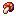

    <i>16/04/2024 ~ #ray-tracing ~ #voxels ~ #grid-traversal</i>
    <h1> Amanatides and Woo</h1>
    
Traversing through grids quickly

## Introduction

<figure title="Figure A: Finding entry cell by truncating">
    <svg class="fig" width="256" viewBox="0 0 194.5 194.5">
        <pattern id="grid32" width="32" height="32" patternUnits="userSpaceOnUse">
            <line x1="0" y1="0" x2="0" y2="32" stroke="#342c28" stroke-width="4" />
            <line x1="0" y1="0" x2="32" y2="0" stroke="#342c28" stroke-width="4" />
        </pattern>
        <pattern id="grid64" width="64" height="64" patternUnits="userSpaceOnUse">
            <rect width="64" height="64" fill="url(#grid32)" />
            <line x1="0" y1="0" x2="0" y2="64" stroke="#3d3a34" stroke-width="5" />
            <line x1="0" y1="0" x2="64" y2="0" stroke="#3d3a34" stroke-width="5" />
        </pattern>
        <rect x="0" y="0" width="194.5" height="194.5" rx="3px" ry="3px" fill="url(#grid64)" />
        <g>
            <path d="m64 81.304 130.5 33.599" fill="#fff" stroke="#7e4d05" stroke-linecap="round" stroke-linejoin="round" stroke-width="3"/>
            <path d="m65.249 194.5 7e-4 -129.25 129.25 0.16817" fill="none" stroke="#fff" stroke-opacity=".53333" stroke-dasharray="12, 12" stroke-dashoffset="21.9" stroke-linecap="round" stroke-linejoin="round" stroke-width="3"/>
            <g stroke-linecap="round" stroke-linejoin="round">
            <text x="93.092438" y="134.0918" fill="#ffffff" fill-opacity=".53333" font-size="20.05px" stroke-dasharray="13.3663, 13.3663" stroke-width="3.3416" xml:space="preserve"><tspan x="93.092438" y="134.0918" fill="#ffffff" fill-opacity=".53333" font-family="'JetBrains Mono'" font-weight="800" stroke-width="3.3416">object</tspan></text>
            <text x="4.1620638" y="24.12842" fill="#3d3a34" font-size="20.05px" stroke-dasharray="13.3663, 13.3663" stroke-width="3.3416" letter-spacing="-4px" xml:space="preserve"><tspan x="3.1620638" y="24.12842" fill="#3d3a34" font-family="'JetBrains Mono'" font-weight="800" letter-spacing="-4px" stroke-width="3.3416">0,0</tspan></text>
            <text x="49.56469" y="46.115707" fill="#fed436" fill-opacity="0" font-size="20.05px" stroke-dasharray="13.3663, 13.3663" stroke-width="3.3416" xml:space="preserve"><tspan x="49.56469" y="46.115707" fill="#fed436" font-family="'JetBrains Mono'" font-weight="800" stroke-width="3.3416">entry cell</tspan>
                <animate
                    attributeName="fill-opacity"
                    values="0;0;0;0;1;1;1;0;0;0;0"
                    dur="10s"
                    repeatCount="indefinite" />
            </text>
            <path d="m0 64 64 17.304" fill="#fff" stroke="#fed436" stroke-width="3"/>
            </g>
            <rect x="65.25" y="65.25" width="32" height="32" fill="none" stroke="#fed436" stroke-dashoffset="200" stroke-dasharray="200" stroke-linecap="round" stroke-linejoin="round" stroke-width="3">
                <animate
                    attributeName="stroke-dashoffset"
                    values="200;200;200;200;0;0;0;200;200;200;200"
                    dur="10s"
                    repeatCount="indefinite" />
            </rect>
            <circle cx="65.5" cy="65.257" r="6" fill="#fff">
                <animate
                    attributeName="cy"
                    values="81.686;81.686;65.257;65.257;65.257;65.257;81.686;81.686"
                    dur="10s"
                    repeatCount="indefinite" />
            </circle>
        </g>
    </svg>
</figure>

